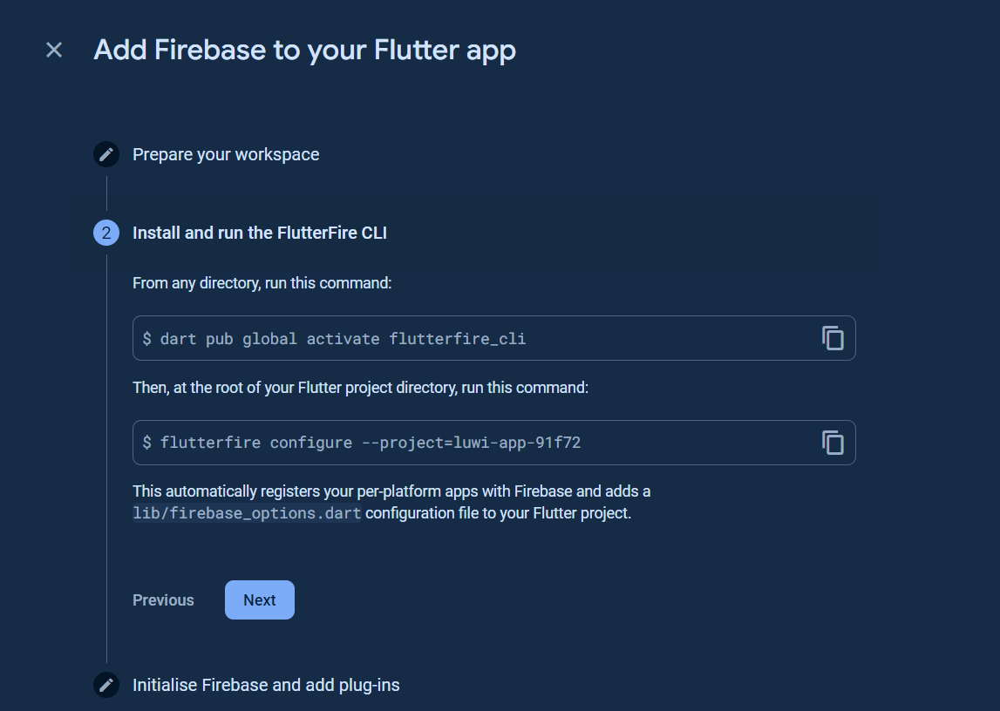
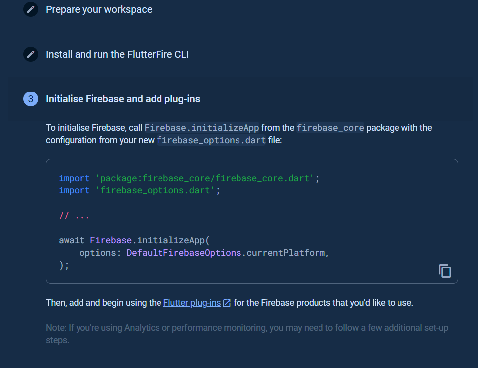

```dart
dart pub global activate flutterfire_cli
flutterfire configure --project=luwi-app-91f72
```

This automatically registers your per-platform apps with Firebase and adds a lib/firebase_options.dart configuration file to your Flutter project.



```dart
import 'package:firebase_core/firebase_core.dart';
import 'firebase_options.dart';

// ...

await Firebase.initializeApp(
    options: DefaultFirebaseOptions.currentPlatform,
);
```


